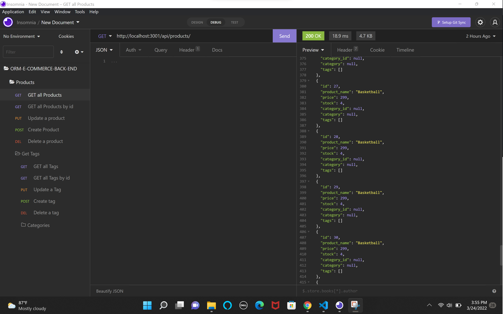

# ORM E-COMMERCE-BACK-END

## Table of Contents
- [Description](#description)
- [Installation](#installation)
- [Usage](#usage)
- [Contribution](#contribution)
- [Testing](#testing)
- [Screenshot](#screenshot)

## Description:
Project based on creating the back end project for an ecommerce site and how you be able to modified by adding routes, updating deleting it and creating using insomnia to test the routes, also we use  express module for the API and sequelize dependency for MySQL database.

## Installation:
We are going to used npm install in the terminal  to install all the packages needed.

## Usage:
We used the project by cloning the repo and and start the project by installing the dependencies using npm i, and then your going to go to the terminal and do a npm start or type node server.js to display the server that contains our work, and node seeds to display the main info for the categories, make sure to take in count after you receive the localhost signal your going add an / and then the routes that your going to test
⬇️
/categories, /products, /tags and id using, / and the id number that your going to test.

## License:
This license is public used you can find it on:
https://opensource.org/licenses/MIT

## Contribution:
Yes you can contribute to the project by sending me  an email.

## Testing:
You can test the project by cloning the repository and start the project by installing the dependencies using npm i, and the next step your going to go the terminal and type node server.js to run the project and node seeds to display the main info for the categories.

## Screenshot:

#### Walkthrough [Video]()

## Contact Information:
- Github: https://github.com/wilmerojeda13.
- Email: ojedawilmerantonio@gmail.com. 